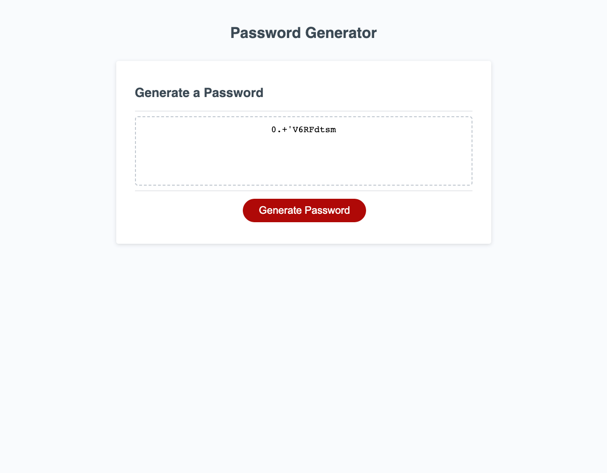

# Password Generator

This is a password generator that will give the user
a password based on user inputs.

## Description

The user will select the "Generate Password" button,
and then the user will be provided with various prompts.
The user will define the length of the password that they
want and the types of characters to use (upper case, lower
case, numberic, and/or special characters). The user is
required to pick a number between 8 and 128 for the length,
and must select at least one of the character options. The
user will then be provided a randomly generated string of
their desired length, using only the characters that they 
opted for.

